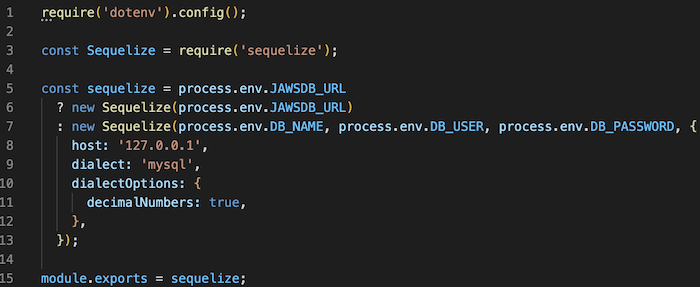

# E-Commerce Back-End
  
## Table of Contents

[Installation](#installation)

[Useage](#useage)

[License](#license)

[Contribute](#contribute)

[Test](#test)

[Questions](#questions)

## Description

The back end for an e-commerce site configured using a working Express.js API to use Sequelize to interact with a MySQL database. This uses the latest technoligies so that a company can compete in the ever evolving world. This has multiple features. The schema is used to create the database. Seeds folder is used to seed data to the database. The models are created to set up the objects in the database. The routes connect the pages and the database. And lastly we have the connection which launches the page. This uses the "dotenv" to make a secure login without displaying the username or password for mysql. This can be seen in following image: 

The following video shows how to use the application. It starts at the point of usage. Please clone the repo to get to this point. 

[Video of working E-Commerce Back-End](https://youtu.be/n378f8uPg40)

## Installation
To install the application, clone it from the repository. 

## Useage
To start and use the application, first open the app in a command line terminal. Then you will need to install the packages using "npm i". Next you will enter into mysql to run "SOURCE db/schema.sql" which creates our database. Next run "node seeds/index.js" to seed the database. This is data created to show how everything works. Lastly, "npm start" to deploy the application to the localhost. 

## License
MIT
  

## Contribution
This was created by Tyler Dinslage using a skeleton frame code from University of California Berkeley full stack web development boot camp. 

## Test
N/A

## Questions
Github Repo: [E-Commerce Back-End Repository](https://github.com/tylerdins88/E-Commerce-Back-End)

Email: tyler.dins88@gmail.com
  